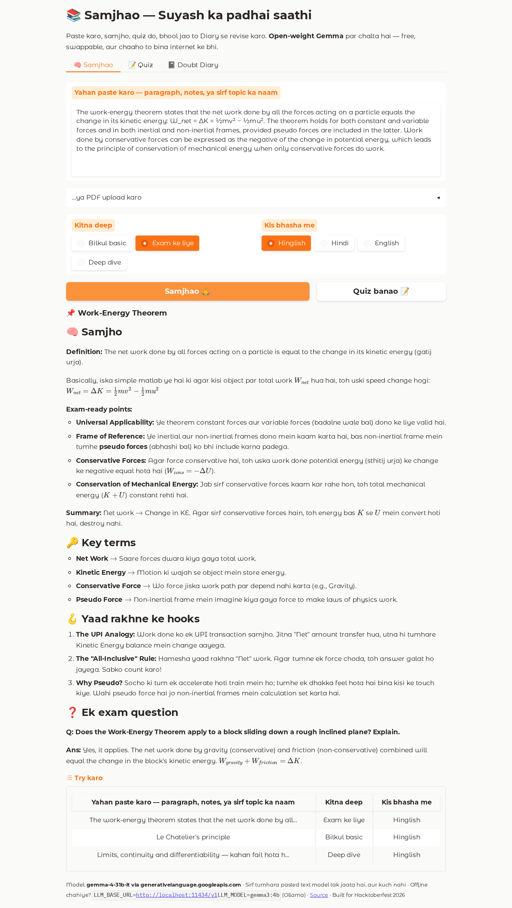
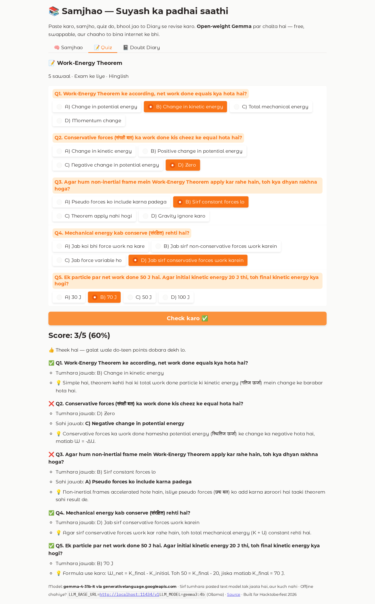
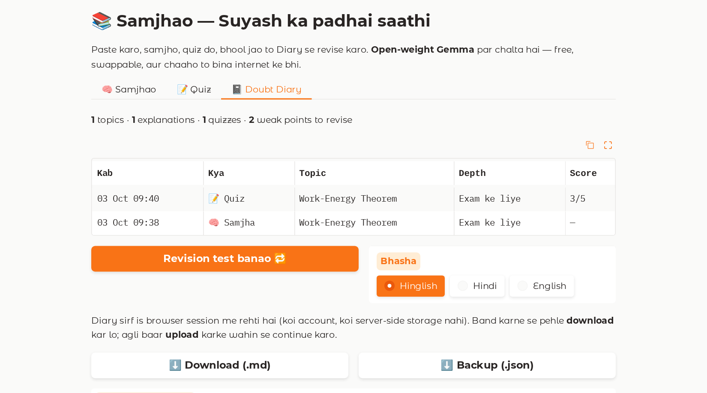

# 📚 Samjhao (समझाओ) — a Hinglish study buddy, built for one friend

> Paste a paragraph from the textbook (or a PDF page, or just a topic name) → get it explained the way a smart friend would, in **Hinglish**, with key terms, memory hooks and an exam question → take a 5-question quiz → everything you struggled with lands in a **Doubt Diary** that turns into a weekly revision test.

Built for **Hacktoberfest 2026 · DEV Weekend Challenge: *Build for a Friend***, with an **open-weight model (Gemma)** at its core.

<!-- screenshot: replace with your own -->
<!--  -->

## Why open-weight matters here

| Need of a student in a UP hostel | What open weights make possible |
|---|---|
| **No money** | Gemma 4 is free on Google AI Studio (no card). Zero running cost. |
| **Hostel wifi dies** | Same app, `LLM_BASE_URL=http://localhost:11434/v1` → Gemma 3 4B via Ollama, fully offline on a CPU laptop. |
| **Their notes are *theirs*** | Nothing is stored server-side. The only thing that leaves the device is the pasted text, to a provider *you* choose — including your own machine. |
| **Hinglish, not corporate English** | Gemma handles Roman-script Hindi + English code-switching well, and the whole persona is a 40-line prompt you can tune. |
| **Future-proof** | Apache-2.0 weights → can be fine-tuned on their syllabus later; the model can never be "deprecated" out from under them. |

Swapping providers is **two environment variables**. That's the whole point of `llm.py`.

## Quickstart (5 commands)

```bash
git clone https://github.com/Yuser00123/samjhao && cd samjhao
pip install -r requirements.txt
cp .env.example .env        # paste your free Google AI Studio key → LLM_API_KEY
python test_llm.py          # 10-second check that Gemma answers
python app.py               # open http://localhost:7860
```

Free Gemma key: <https://aistudio.google.com/apikey> (model id `gemma-4-31b-it`, Apache-2.0).

### Run it fully offline (Ollama)

```bash
ollama pull gemma3:4b       # ~3 GB, runs on CPU
# .env
LLM_BASE_URL=http://localhost:11434/v1
LLM_MODEL=gemma3:4b
LLM_API_KEY=ollama
```

### No key at all?

`LLM_PROVIDER=mock` runs the UI with canned text — handy for checking the layout on a phone.

## Deploy on Render (free)

1. Push this repo to GitHub.
2. Render → **New → Blueprint** → pick the repo. `render.yaml` sets everything up (free plan, Singapore region).
3. Add the secret **`LLM_API_KEY`** in the Render dashboard, and set `FRIEND_NAME` to your friend's name.
4. Share the URL. On a phone, "Add to Home Screen" works — the app ships as a PWA.

Free instances sleep after 15 min of inactivity; the first request after that takes ~30–60 s. Tell your friend. 🙂

## Screenshots

| Samjhao (explain) | Quiz + check | Doubt Diary |
|---|---|---|
|  |  |  |

## Features

- **`GET /health`** — liveness probe returning `{"status": "ok", "service": "samjhao", "model": "…", "uptime_seconds": n}`; used by Render's health check (`healthCheckPath` in `render.yaml`) and handy for uptime monitors.

- **🧠 Samjhao** — three depths (*Bilkul basic* / *Exam ke liye* / *Deep dive*), three languages (Hinglish / Hindi / English). Streams the answer. Fixed structure: explanation → key terms (English → Hindi) → 3 memory hooks → one exam question with model answer.
- **📄 PDF in** — pick a page range from a text-based PDF (scanned PDFs: paste the text instead).
- **📝 Quiz** — 5 MCQs generated as strict JSON from the same material, scored instantly with a *why* for every question.
- **📓 Doubt Diary** — every explanation and quiz is logged in the browser session; wrong answers become **weak points**; one tap builds a **revision test** that targets them. Export `.md`/`.json`, re-import next time. No accounts, no database.

## Project layout

```
app.py        Gradio UI + handlers, mounted on FastAPI (adds GET /health)
llm.py        provider-agnostic chat/stream/JSON — OpenAI-compatible, google-genai, or mock
prompts.py    the persona and the three jobs (explain / quiz / revision)
extract.py    PDF → text, truncation, topic guessing
diary.py      Doubt Diary (session list, export/import, weak-point tracking)
test_llm.py   smoke test for your .env
render.yaml   one-click Render blueprint
```

## Configuration

| Variable | Default | Notes |
|---|---|---|
| `LLM_PROVIDER` | `openai` | `openai` (any OpenAI-compatible endpoint) · `google` (native SDK, needs `pip install google-genai`) · `mock` |
| `LLM_BASE_URL` | Google AI Studio OpenAI endpoint | Ollama: `http://localhost:11434/v1` · Groq: `https://api.groq.com/openai/v1` |
| `LLM_MODEL` | `gemma-4-31b-it` | Ollama: `gemma3:4b`, `gemma3:12b`, … |
| `LLM_API_KEY` | — | Google AI Studio key / `ollama` / Groq key |
| `FRIEND_NAME`, `FRIEND_CITY`, `FRIEND_EXAM` | `Dost`, `Prayagraj`, `""` | Personalises the title and prompts |
| `FOLD_SYSTEM` | `0` | Set `1` if a provider rejects the `system` role (handled automatically on first error too) |
| `DIARY_PATH` | — | Persist the diary to a local JSON file when running on your own machine |

## Honest limitations

- Free-tier rate limits (~15 req/min on AI Studio) — the app retries politely and tells you to wait.
- Scanned PDFs have no text layer; OCR is out of scope for a weekend.
- The Doubt Diary is per-browser-session by design (Render's free disk is ephemeral and we didn't want accounts). Export before closing.
- Gemma occasionally switches Hinglish → Devanagari mid-answer on long outputs; the style rule in `prompts.py` keeps it rare.

## License

MIT. Gemma weights are under Apache-2.0 (Google). Built during the Hacktoberfest 2026 Weekend Challenge window (2–5 Oct 2026); any commits after the deadline are listed below.

**Post-deadline commits:** none yet.
